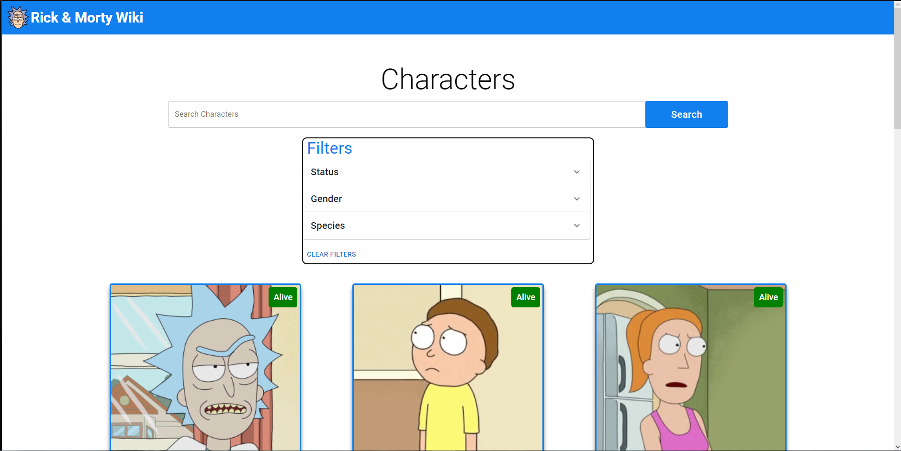
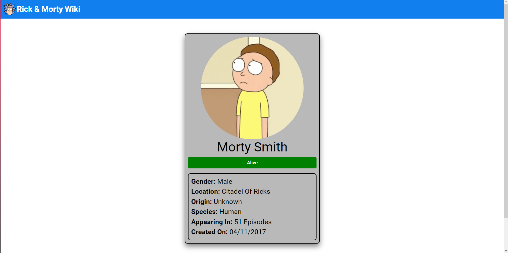

<!-- PROJECT LOGO -->

  <h1 align="center">Rick and Morty wiki</h1>

  <h3 align="center">
   Search your favorite Rick and Morty characters
  </h3>
  
 
 ### Click here for live demo   <a href="https://athomeproject.netlify.app">Rick and Morty wiki</a>

<!-- ABOUT THE PROJECT -->

## About The Project:

### Homepage:

On the homepage the user can see top characters and even search them trough search field with name or by using filters.

### Character Page:

On the character page the user can see detailed information about the character

#### The common funtionalities are:

- The user can see top characters on the homepage
- The user can search by name all the characters available in database
- The user can filter all the characters by Status, Gender or Species
- The user can click on each character to view detailed information about that character

I'm using [Rick and Morty](https://rickandmortyapi.com) to get characters.

##### Credit: Rick and Morty API

### Built With

- #### ReactJS
- #### Material UI
- #### Rick and Morty API

### Key concepts:

- #### Material UI
- #### Fetching data from an API
- #### Handling events
- #### String manipulation
- #### Filtering data
- #### JavaScript Object Oriented Programming
- #### React Hooks
- #### React components
- #### React state and props

<!-- GETTING STARTED -->

# Getting Started

## After cloning github repository

### To install all dependency necessary:

### `npm i`

This project was bootstrapped with [Create React App](https://github.com/facebook/create-react-app).

## Available Scripts

### To run project:

### `npm start`

### To build project:

### `npm run build`
